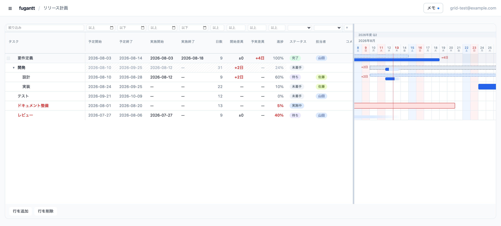
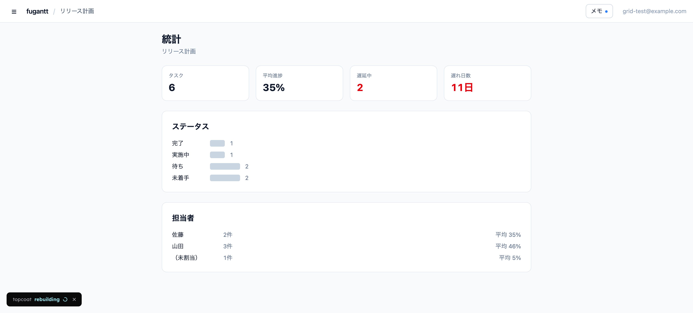
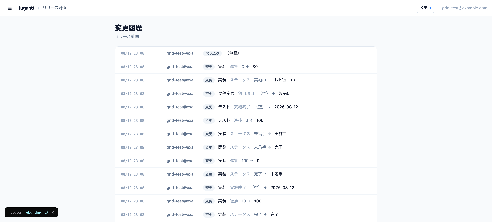

# fugantt

**Plan against actual, counted in working days.**

A Gantt chart you edit from the keyboard, for teams who have to answer not just
"when is it due" but "how far off the plan did it run, and why". Rust server,
SQLite, one binary. The grid is plain TypeScript; everything else is HTML.

[日本語の README](README.md)



## The problem it solves

Most schedule tools hold one set of dates. Real projects hold two: what was
planned, and what happened.

- **Planned and actual on one row.** The start and end variances are not stored;
  they are subtracted on every read.
- **Days counted the way your workplace counts them.** Weekends, public
  holidays, leave and waiting periods are excluded — or not, per project.
- **The delay is split.** Not "twelve days late", but "nine days of work, three
  days waiting on another team".
- **Behind means behind the plan you wrote.** Enter "50% by the 20th" and the
  shortfall is drawn from where the work got to up to the half of the bar, with
  `8/20 50%` written at its end. Grab that bar and it sets a percentage, so its
  axis is read as one — and two things that are compared have to share a ruler.
  Reach the promise and the red is gone. Enter nothing and nothing is claimed: a
  schedule tool that guesses your plan from the dates is judging you against a
  plan nobody agreed to.
- **Late is a column, not a colour.** Second from the left, filterable, so
  "show me only the late ones" is a question the table can answer.
- **Waiting is recorded**, with dates and a reason. Those days count towards
  neither the duration nor the lateness.
- **Two thousand rows type as fast as ten.** Only the rows on screen are in the
  document; the rest are a spacer of the right height.
- **Who has room is a page.** Per person, per month: the days they could work,
  the days already taken, what is left, and which days those are.

| | |
| --- | --- |
| Statistics |  |
| History |  |

## Editing

The grid is keyboard-first. Whatever people are keeping their plans in now,
they are typing into it without reaching for the mouse, and anything slower than
that gets abandoned within a week.

Arrows move, Enter opens a cell, Tab goes right, Escape puts it back.
`⌘Enter` / `Ctrl+Enter` adds a row, `⌥→` / `Alt+→` makes it a child, `⌥↑` / `Alt+↑`
moves it within its siblings. Either modifier works on either platform; only the
label on the screen changes.
Bars drag: the body moves the dates, the ends stretch them, and the handle
inside the plan bar sets the progress.

`⌘Z` / `Ctrl+Z` takes back the last value this tab changed, `⌘Y` / `⌘⇧Z` puts
it back. Only your own edits, and only while the tab is open: if somebody else
has touched the same cell in the meantime it stops and says so, because undoing
their work is the one thing an undo must never do. Adding, deleting and
reordering rows are not undoable.

Dates take whatever you type — `20260805`, `8/5`, `2026-08-05` — including
full-width digits, so a Japanese keyboard never has to switch modes.

Pointing at a bar shows its dates, and whatever else the project asked for —
including columns taken off the table, and including its own fields. A column
worth a glance now and then does not have to sit on the screen all day.

Right-click gives the outline moves by name, and the row's own colours —
background and text, from a short palette. People were already marking rows by
writing ★ into the task name; this is the same intent with a tool that does not
sort, export and stay there for ever.

Filters sit above the columns, one per column, ANDed together. Dates and numbers
compare rather than match: pick **at least / at most / equals / more than / less
than** from the button beside the box. The 遅延 column is picked from a list:
late, or on time.

## Who has room

The schedule says when things are due. The question asked over it is whether the
person you are about to hand something to has any room, and that used to be
answered by running a finger across the chart.

| Person | Available | Elapsed | Committed | Free | Overlapping | |
| --- | --- | --- | --- | --- | --- | --- |
| 佐藤 | 21d | 10d | 11d | **0d** | 5d | Overlapping: 8/24–8/28 |
| 山田 | 21d | 10d | 0d | **11d** | — | Free: 8/17–8/31 |
| (unassigned) | — | — | 6d | — | — | |

Counted from today. Days already gone are their own column, because half a month
gone with "twelve days free" in it is a lie by arithmetic — and available =
elapsed + committed + free, so the row adds up.

A day is either taken or it is not. Three tasks on one Tuesday is one Tuesday —
counting it three times produces the 300% loads that make a report unreadable
and then unread — and how deep the stacking goes is its own column, because
"booked solid" and "booked three times over" need different answers. Finished
work and summary rows are left out, leave comes off the available days, and the
stretches are printed, because "nine days free" is half an answer.

No effort percentages. A finer unit needs a number on every task that nobody
would keep up to date, and an invented number in a capacity table is worse than
no table.

## Where it came from

fugantt was built for 予実管理 — the Japanese practice of managing a plan
against its actuals — and that shows in the defaults rather than in the
architecture.

- **Public holidays are computed, not pasted.** `src/holidays.rs` implements the
  rules, including substitute holidays and the "citizens' holiday" that appears
  between two others.
- **The business year sits above the months**, starting in whichever month you
  say (April by default, which is the Japanese norm; October and January are a
  setting away).
- **Saturday is blue and Sunday is red**, the way a Japanese calendar prints
  them. Same-grey weekends are misread.
- **Japanese era years** (`令和8年度 Q2`) are available, and stored as data — a
  new era means adding one line in the settings, not shipping a build.
- The weekday is printed under every date. Counting to a Friday off a month grid
  is not a plan.

None of this is hard-coded to one country: the holiday list, the business year,
the weekdays you skip, and the language are all settings.

## Language

Japanese by default, English when the reader's browser asks for it. The order
is: the person's own setting, then the installation's, then `Accept-Language`
— which browsers fill in from the operating system.

What the users named — statuses, their own fields, people, projects — is data
and is never translated. Two people should not read the same plan in different
words.

## Running it

```sh
brew install fu-foo/tap/fugantt
scoop bucket add fu-foo https://github.com/fu-foo/scoop-bucket && scoop install fugantt
docker run -p 1861:1861 -v fugantt:/data ghcr.io/fu-foo/fugantt

cargo-topcoat dev            # from source. http://127.0.0.1:1861
```

On Windows, either unzip `fugantt-windows-x86_64.zip` and double-click the
executable — it opens its own window, and the console that stays behind is the
server — or install it with [Scoop](https://scoop.sh), which needs no
administrator and no installer:

```powershell
Set-ExecutionPolicy -ExecutionPolicy RemoteSigned -Scope CurrentUser
Invoke-RestMethod -Uri https://get.scoop.sh | Invoke-Expression

scoop bucket add fu-foo https://github.com/fu-foo/scoop-bucket
scoop install fugantt
```

Unsigned, so the first run brings up SmartScreen: "More info" then "Run anyway".
A Scoop install lives in a folder named after the version and is replaced on
update, so put `fugantt.ini` in `%LOCALAPPDATA%\fugantt\` rather than beside
the executable. The database is already there.

Four binaries on every release: macOS on Apple Silicon and on Intel, Windows,
and Linux — **Apple Silicon is native**, and `brew` installs the arm64 build on
an M-series Mac. The Windows build links the C runtime statically, so it is one
file and nothing else. Only the container image is amd64-only: an arm64 image
would be built under emulation in CI, and a Rust release build in QEMU takes
long enough to make cutting a release something nobody does. On Apple Silicon,
`--platform linux/amd64` runs it, or use the native binary.

The port is **1861** — the year Henry Gantt was born. 3000 and 8080 are where
every second development tool lives, and two programs on one port fail in a way
that looks like the application being broken rather than the port being taken.

Settings are environment variables, or the same names written in a
`fugantt.ini` beside the executable — in the working directory, or in the
platform's own place for user data. The environment wins, because that is what
Docker and Fly pass in. `fugantt --help` lists what can be set and
`fugantt --config` says where each value came from.

Started on loopback, it opens the page itself — an Edge application window on
Windows, a tab elsewhere. `FUGANTT_OPEN=0` if you would rather it did not.

The database is `FUGANTT_DB`, or a `fugantt.db` already in the working
directory, or the platform's own place for user data — `%LOCALAPPDATA%`,
`~/Library/Application Support`, `~/.local/share`. Whichever it is, the absolute
path is printed at startup, and it is migrated on first start.

For a release build, `cargo build --release` produces a single executable with
the static files embedded — deploying is that file and a database, and nothing
else.

SQLite means **one machine**. The same database opened by two servers is two
different plans.

Backups are a button in the installation settings: one file out, the same file
back in. Restoring keeps what was there a moment before, next to the database,
because restoring the wrong file is a mistake people make in a hurry. Accounts
and passwords go back with everything else.

## Getting data in and out

Excel (`.xlsx`) for reading: the same columns as the screen, with the chart
drawn cell by cell to its right. JSON for moving: the whole project — settings,
statuses, people, calendar and tasks — in one file.

The tasks can travel on their own — "Tasks only" in the drawer, `?settings=0`
on the endpoint — for anyone handing the plan to a program that has no use for
a page of colours. A file with no settings section still imports; it simply
says nothing about the parts it leaves out.

The JSON is meant to be read, edited and handed back, including by a program:

```json
{
  "version": 1,
  "name": "Release plan",
  "tasks": [
    {
      "id": "c0ffee…", "name": "Requirements", "depth": 0,
      "start": "2026-08-03", "end": "2026-08-14",
      "actual_start": "2026-08-03", "actual_end": "2026-08-18",
      "progress": 100, "status": "完了", "assignee": "山田",
      "waits": ["2026-08-17/2026-08-21"],
      "targets": ["2026-08-10/50"],
      "fields": { "Product": "A" }
    }
  ]
}
```

| | |
| --- | --- |
| `depth` | From 0. Deeper than the row above means a child of it. |
| `waits` | `"from/to"`. Omit the end (`"from/"`) and it is still waiting. |
| `targets` | `"date/percent"`. What the plan promises by when. Nothing here means the row is never behind on progress. |
| `id` | Present and known: updated. Absent: added. Missing from the file: removed. Leave it out when writing by hand. |
| references | Statuses, people and fields are named, never referenced by id. |
| summary rows | Their dates and progress are not written out: they come from the children. |

**No derived value is in the file** — no day counts, no variance, no lateness.
Nothing written back can contradict itself. To *read* those, ask
`GET /api/projects/{id}/grid`, which returns the table already computed.

> Read from the grid, write to the document.

## API tokens

A token opens one project, with one role, and is shown once.

```sh
curl -H "Authorization: Bearer fug_…" \
  https://example.com/api/projects/release-plan/document

curl -X POST -H "Authorization: Bearer fug_…" \
  -H "Content-Type: application/json" --data @plan.json \
  https://example.com/api/projects/release-plan/document
```

A token for another project is refused, and a read-only token cannot write. A
change made with a token is recorded as **`API <what the token is for>`** — no
person's name, because nobody did that work, but never anonymous either.

For numbers across projects, an administrator issues a key that reads all of
them:

```sh
curl -H "Authorization: Bearer fug_…" https://example.com/api/projects   # the plans
curl -H "Authorization: Bearer fug_…" https://example.com/api/summary    # per project
```

`/api/summary` is the statistics page's arithmetic, one row per project
(`late_days + wait_days = slipped`). Both work with a signed-in session too, and
then return only what that person may see.

## How it looks

Theme — automatic, light or dark — and your own CSS, both per person and
visible to nobody else. The plan's colours are not part of it: bars, statuses
and people belong to the project, because two people reading the same plan in
different colours are reading two different plans.

Your CSS is loaded last, so it wins. 20,000 characters, and `@import` is
defanged.

## Roles and sign-in

- **The base roles "editor" and "viewer" apply to every project.** To keep a
  plan to a few people, set the base to "no access" and add them as members.
- The password rule — minimum length, required kinds of character, refused
  words — is set per installation.
- Changing a password ends that person's other sessions.

`FUGANTT_NO_AUTH=yes-everyone-on-this-network-can-edit` runs it without sign-in
at all. **Everyone who can reach that URL can read and edit every project.** A
banner stays on screen while it is on.

## Supporting

If you find this project useful, consider supporting its development:

[](https://github.com/sponsors/fu-foo)
[](https://ko-fi.com/fufoo)

## Licence

Apache License 2.0

Copyright 2026 Kazunari Fukagawa
