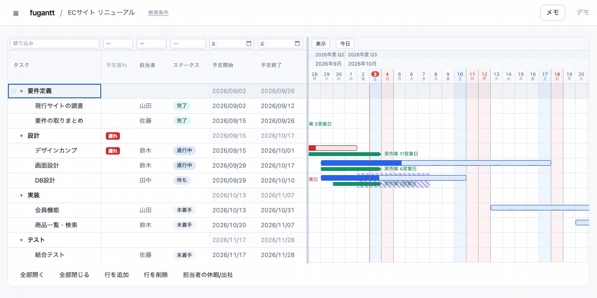
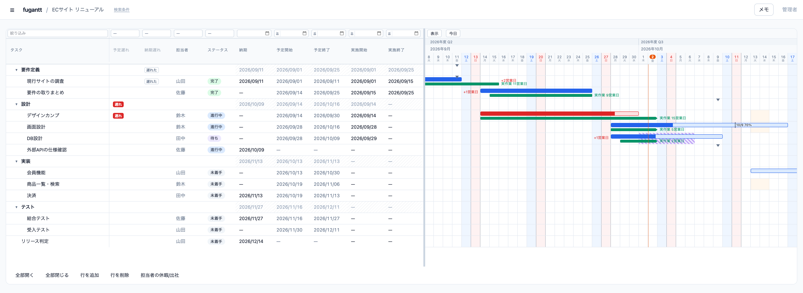
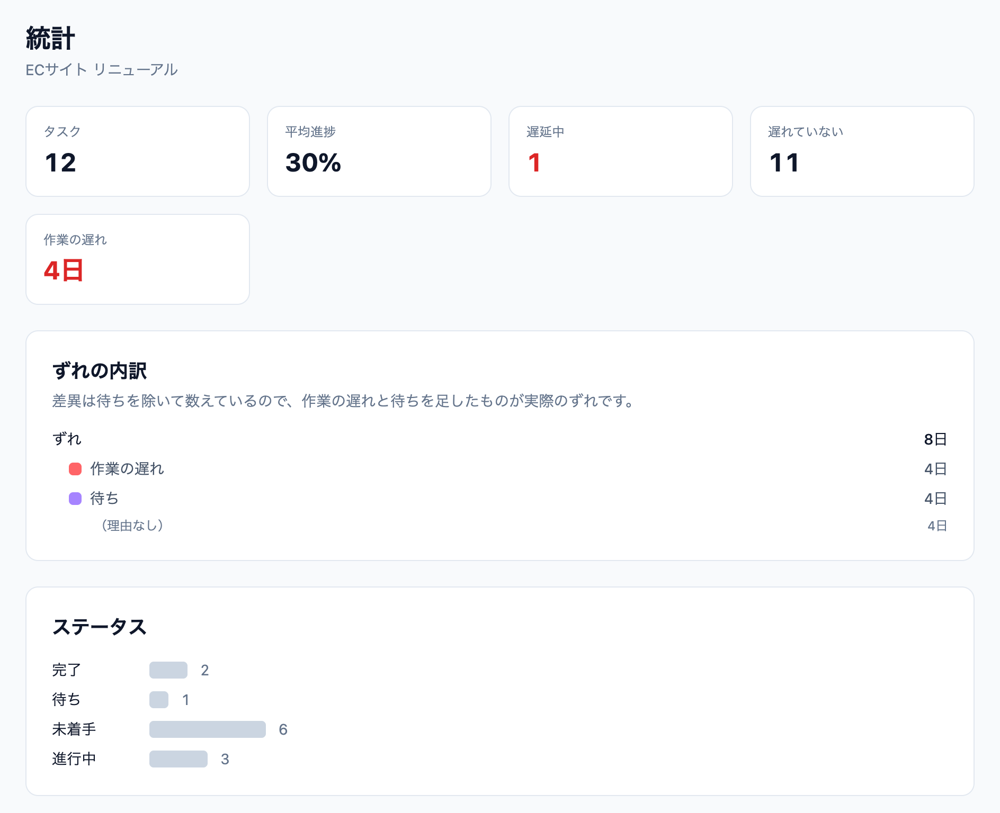
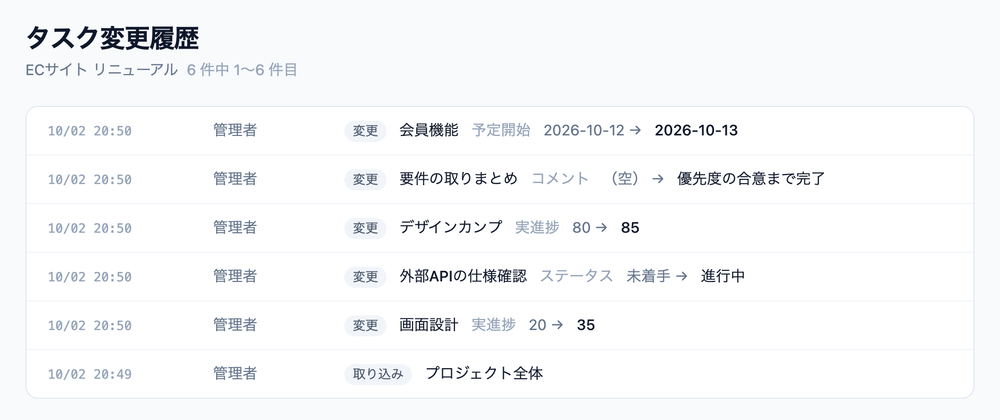

# fugantt

**Plan against actual, counted in working days.**

A Gantt chart you edit from the keyboard. Rust (Topcoat + SQLite), one binary.

[日本語の README](README.md)



## What it does

- **Planned and actual on one row.** The start and end variances are worked out for you.
- **Behind on progress means behind the checkpoints you entered.** Rows with "50% by the 20th" entered turn red when they fall short; rows without it are never behind on progress (overdue and past-due rows turn red regardless).
- **The delay is split.** Not "twelve days late", but "nine days of work, three days waiting".
- **Who has room is a page.** Per person, per month or over any range: the days already taken, the days free, and which days those are.
- **Undo.** `⌘Z` / `Ctrl+Z` — values, added rows, reordering. A cell somebody else touched in between is left alone. Deleting a row cannot be undone.
- **Days counted the way your workplace counts them.** Pick the weekdays, holidays and leave to leave out (weekends, holidays and leave by default). Waiting is always left out.
- **Fits the Japanese calendar.** Holidays are computed (substitute and citizens' holidays included), business years, era years, blue Saturdays and red Sundays.
- **Keyboard editing**, with Japanese input passing straight through.
- **The chart adjusts with the mouse.** Drag a bar to move its dates, pull an end to stretch it, slide the handle inside to set progress.
- **Excel and JSON export.** JSON imports, too.
- **Japanese by default**, English when the browser asks for it (or set it yourself).
- **More rows do not slow typing down.** Only the rows on screen are drawn, so a keystroke takes about as long at ten thousand rows as at a hundred ([measured](docs/reference.en.md#what-10-promises)).



**Statistics** are per project: the task count, average progress, how many are late now, the split of the delay
(work, and waiting by reason), and counts by status and by person.
**Task history** shows who changed which value, and when.

| | |
| --- | --- |
| Statistics |  |
| Task history |  |

## Install

Four binaries on every [release](https://github.com/fu-foo/fugantt/releases). Each holds one executable, with nothing else to install.

| | |
| --- | --- |
| `fugantt-macos-arm64.tar.gz` | macOS / Apple Silicon (native — no Rosetta) |
| `fugantt-macos-x86_64.tar.gz` | macOS / Intel |
| `fugantt-windows-x86_64.zip` | Windows 64-bit (C runtime linked statically) |
| `fugantt-linux-x86_64.tar.gz` | Linux 64-bit (glibc) |

### Windows

**① Unzip and run**

1. Download `fugantt-windows-x86_64.zip` from [Releases](https://github.com/fu-foo/fugantt/releases)
2. Unzip it anywhere (`C:\fugantt`, say)
3. Double-click `fugantt.exe`. The page opens in an Edge application window

- The first run says "**Windows protected your PC**" — it is unsigned. "More info" → "Run anyway"
- A console window stays open. **That is the server**
- The data is in `%LOCALAPPDATA%\fugantt\fugantt.db`

**② Scoop** (if you want updates handled)

[Scoop](https://scoop.sh) needs no administrator and no installer. In PowerShell:

```powershell
# Scoop itself (once)
Set-ExecutionPolicy -ExecutionPolicy RemoteSigned -Scope CurrentUser
Invoke-RestMethod -Uri https://get.scoop.sh | Invoke-Expression

# fugantt
scoop bucket add fu-foo https://github.com/fu-foo/scoop-bucket
scoop install fugantt
```

Then `fugantt` starts it, `scoop update fugantt` updates it, `scoop uninstall fugantt` removes it.

> Scoop replaces the install folder on every update. **Put `fugantt.ini` in
> `%LOCALAPPDATA%\fugantt\`, not beside the executable**, or an update removes it. The database is already there.

### macOS / Linux

```sh
brew install fu-foo/tap/fugantt
```

On a Mac, brew is the way. Downloaded straight from Releases, the binary is not notarized by Apple and Gatekeeper stops the first
run; `xattr -d com.apple.quarantine fugantt` in the unpacked folder lets it start.

### Docker

```sh
docker run -p 1861:1861 -v fugantt:/data ghcr.io/fu-foo/fugantt
```

`-p 1861:1861` above publishes the port beyond the host. Until the [first account](#the-first-account) exists, run it
with `-p 127.0.0.1:1861:1861` instead (the data stays in the volume, so start it again afterwards). Read
[On an office LAN](#on-an-office-lan) before opening it from other machines.

The image is amd64 only. On Apple Silicon add `--platform linux/amd64` (it runs under emulation), or use the
native binary above.

## Start it

```sh
fugantt
```

It listens on `http://127.0.0.1:1861` and opens the page (an Edge application window on Windows, the default
browser elsewhere). Close the terminal it runs in (on Windows, the console window) or press Ctrl+C to stop.
Closing the browser does not stop it.

> **The port is 1861** — the year Henry Gantt was born.

### The first account

While there is nobody in the installation, the sign-in page shows **"Create the first account"** beside it.
Enter a name, a user name and a password (eight characters or more by default); whoever registers becomes the
**administrator**.

Everyone after is created by an administrator on the users page, who hands over the first password. There is no
open sign-up and no mail.

Anyone who can reach "Create the first account" can use it. Create the first account locally before serving the LAN (`HOST=0.0.0.0`).

If no administrator can get in (a lost password, someone who left), run `fugantt --make-admin <user name>` on the server to make
another account an administrator. The server can keep running, and that person need not sign in again: reloading the page is enough.
The command does not reset passwords; the new administrator sets the old one's again.
If the administrator's is the only account, there is nobody to promote — so make at least two accounts.

### The first project

1. Type a name under "New project" and create it
2. Press "Add the first task" and type its name. After that, **⌘Enter / Ctrl+Enter** adds a row below
3. Type the planned start and end. A date can be just digits: `5` is the 5th of this month, `1225` is December 25th
4. When work starts, enter the actual start; when it ends, the actual end. The actual line appears under the planned bar
5. Pick or type the assignee and the status. The **due date** is the date it has to be done by — a promise, kept
   apart from the plan (your own schedule). [More in the guide](docs/guide.en.md#due-dates)

### In the background

```sh
fugantt start     # starts it and returns (the page still opens)
fugantt status    # whether it is running, and where: version, URL, data, log
fugantt log       # the end of its log
fugantt stop      # stops it
fugantt version   # the version
```

## Configure it

Settings are environment variables, or the same names written in **`fugantt.ini`** (beside the executable, in the
working directory, or in the platform's place for user data). **The environment wins.**

```ini
# fugantt.ini
PORT = 3100
FUGANTT_DB = D:\plans\fugantt.db
```

| Name | Default | |
| --- | --- | --- |
| `HOST` | `127.0.0.1` | `0.0.0.0` to serve the LAN |
| `PORT` | `1861` | |
| `FUGANTT_DB` | see below | The SQLite file. Migrated on start |
| `FUGANTT_OPEN` | automatic | Whether to open the page on start: `window` (application window) / `tab` / `0` (don't) |
| `FUGANTT_ALLOW_HTTP` | — | `1` allows signing in over plain HTTP (below) |
| `FUGANTT_NO_AUTH` | — | Run without sign-in ([reference](docs/reference.en.md#running-without-sign-in)) |

Without `FUGANTT_OPEN`, the page opens only when started on loopback: an application window on Windows, a tab elsewhere.

`fugantt --config` says where each value came from; `fugantt --help` lists what can be set.

**The database** is `FUGANTT_DB`, or a `fugantt.db` already in the working directory, or the platform's place for
user data — `%LOCALAPPDATA%\fugantt`, `~/Library/Application Support/fugantt`, `~/.local/share/fugantt`.
The absolute path is printed at startup.

### On an office LAN

`HOST=0.0.0.0` makes it reachable, but signing in from a LAN address will not work as it is: the session cookie is
`Secure`, and browsers do not accept that from `http://` anywhere but localhost.

- Serve it over HTTPS (Caddy's `tls internal`, a Tailscale certificate). Recommended
- If you cannot, `FUGANTT_ALLOW_HTTP=1`. The session token then travels in the clear, and a warning is printed at startup

Notes for reverse proxies are in the [reference](docs/reference.en.md#defences).

### On the internet

It is meant for your own PC and an office LAN. Sign-in is a user name and a password, with no second factor.

To use it from outside, keep it closed behind Tailscale, or put authentication in front (SSO through Cloudflare
Access or oauth2-proxy). Turning fugantt's own sign-in off with `FUGANTT_NO_AUTH` loses who changed what, so keep both.

Authentication in front also stops calls made with API tokens; let that path through at the front (a service token on
Cloudflare Access, `skip_auth_routes` on oauth2-proxy). The front must pass `Host` as the browser sent it
([reference](docs/reference.en.md#defences)).

## Running it

- **Backups are a button in the installation settings.** One file out, the same file back in. Restoring keeps what
  was there a moment before, next to the database. **Accounts and passwords go back too**
- From the command line, use `VACUUM INTO`. Recent changes live in the `-wal` file, so copying `fugantt.db` alone can miss them
  ```sh
  sqlite3 fugantt.db "VACUUM INTO '/backup/fugantt-$(date +%F).db'"
  ```
- **One server only.** Everyone else comes in through the browser. Two servers on the same
  database do not see each other's changes on screen (change notices travel only inside one server)
- **Do not put the database on a shared folder and open it from each PC.** Besides the above, SQLite's locking cannot
  be trusted over a network file system, and the file can be corrupted
- **Updating is replacing the executable.** Migrations run by themselves; there is no going back to an older version. Back up first.
  The database is looked for the same way, so an existing `fugantt.db` carries on.
  The running version is at the bottom of the drawer, and in `fugantt status`
- **Upgrading from 0.3 or earlier: the port changed** from 3000 to 1861. Fix bookmarks and `docker run -p 3000:3000`,
  or write `PORT = 3000`

## Documentation

| | |
| --- | --- |
| [Guide](docs/guide.en.md) | The table and the chart, due dates, plan and actual, lateness, availability, statistics, settings, import |
| [Reference](docs/reference.en.md) | Keys, settings, the JSON format, the API, roles and sign-in, what 1.0 promises |
| [Design](docs/design.en.md) | Why it behaves the way it does |

## Development

Needs Rust (the latest stable) and topcoat-cli.

```sh
cargo install topcoat-cli --version 0.5.0
```

```sh
cd apps/fugantt
cargo-topcoat dev                    # http://127.0.0.1:1861, rebuilt on save
cargo build --release -p fugantt     # one executable, static files embedded
```

> `cargo-topcoat dev`, not `cargo topcoat dev`: topcoat-cli 0.5.0 cannot read its arguments when called as a cargo
> subcommand. `cargo run -p fugantt` works too.

After changing the grid (TypeScript), run `npm run build` in `crates/fu-gantt-web/web` and commit `dist/` with it.

### What is where

| Place | What |
|---|---|
| `apps/fugantt` | fugantt itself: the database, sign-in, pages and API |
| `crates/fu-calendar` | Japanese public holidays, worked out from the rules. No dependencies |
| `crates/fu-gantt-core` | The chart's arithmetic, and the JSON the grid and its host exchange |
| `crates/fu-gantt-web` | The grid (`grid.ts`) and its built files |
| `examples/minimal-host` | The smallest host that shows the grid without fugantt |

How to put the grid into another program is in [docs/gantt-api.md](docs/gantt-api.md) (Japanese).

## Supporting

If you find this project useful, consider supporting its development:

[](https://github.com/sponsors/fu-foo)
[](https://ko-fi.com/fufoo)

## Licence

Apache License 2.0

Copyright 2026 Kazunari Fukagawa
